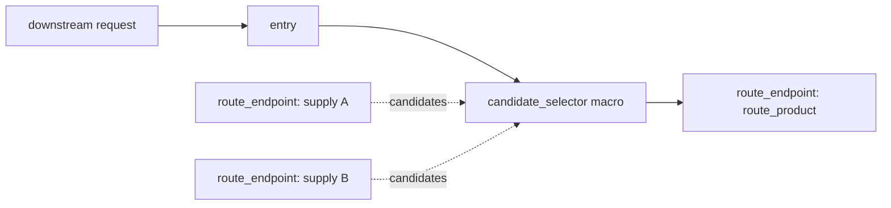

# Graph Routing

Graph Routing 是 Metapi 的图原生路由模型。它统一描述下游入口、请求过滤器、上游供给端点、路由组、合成响应和候选选择策略。

可编辑对象是语义化的 source graph。发布后，source graph 会编译为扁平运行时程序，代理请求时不解释画布布局、折叠状态或调试节点。

## 阅读路径

| 分类 | 文档 | 内容 |
|------|------|------|
| 概览 | 当前文档 | 模型层级、核心对象、可见性和编译链路 |
| 操作指南 | [路由组](./route-groups-guide.md) | 日常创建、调整和发布路由组 |
| 操作指南 | [图编辑器](./route-graph-editor-guide.md) | 语义图编辑、生成视图和编译诊断 |
| 运行模型 | [运行时路由流](./model-route-flow.md) | 模型广场和模型测试中的路由流程来源 |
| 运行模型 | [概率与成本估算](./route-probability-cost.md) | 候选概率、理论成本、参考倍率和估值规则 |
| 参考 | [Source JSON](./route-graph-json-overview.md) | 源图 JSON 结构和导入导出约定 |
| 参考 | [节点参考](./route-graph-nodes-reference.md) | 节点、macro、port 和字段定义 |
| 参考 | [Filter 参考](./route-graph-filters-reference.md) | 请求过滤器操作和参数 |
| 参考 | [Metadata 与 CEL](./route-graph-metadata-cel-reference.md) | 请求元数据、候选 metadata 和 CEL 表达式 |
| 示例 | [Recipes](./route-graph-recipes.md) | 常用路由模式和 JSON 示例 |

## 模型层级

Graph Routing 明确区分编辑模型、调试模型和运行模型。

| 层级 | 作用 |
|------|------|
| Source graph | 用户编辑的语义图，存储为 `RouteGraphSource` |
| Macro lowering | 为校验、预览和诊断生成 primitive graph |
| Flat program bundle | 请求路由使用的运行时程序 |
| Hydrated selectors | 带 CEL 缓存和运行时状态访问的内存选择计划 |

source graph 是编辑契约，flat program bundle 是执行契约。UI 可以展示二者的不同视图，但不能把画布布局当作运行时行为来源。

## 核心对象

| 对象 | 职责 |
|------|------|
| `entry` | 对外暴露的下游模型入口 |
| `candidate_selector` macro | 路由组语义节点 |
| `route_endpoint` `endpointKind=supply` | 具体上游模型供给端点 |
| `route_endpoint` `endpointKind=route_product` | 可复用的路由产物 |
| `filter` | 请求 payload、header、model 或 endpoint preference 改写 |
| `dispatcher` | 由 macro 生成或在高级场景中手写的候选选择 primitive |
| `synthetic_endpoint` | 固定错误、降级响应或其它合成终端 |

新的 route graph JSON 不使用 `channel`、`pool` 或 `target_pool`。上游可调用对象统一建模为 `route_endpoint endpointKind=supply`；可复用路由产物统一建模为 `route_endpoint endpointKind=route_product`。

## 路由组结构

自动路由组和手动路由组都表示为 `candidate_selector` macro。对外暴露的路由组通常包含一个 public entry，并接入一个或多个 candidate supply endpoint。



macro 是用户编辑的语义对象。生成的 entry、filter、dispatcher 和 candidate edge 是派生产物，用于预览、校验和运行时编译。

## 编辑入口

### 路由组视图

路由组视图是日常维护入口。它是 source graph 的结构化编辑器，不是独立路由模型。

适合维护：

- 自动路由组可见性；
- 手动路由组；
- 优先级桶和权重；
- candidate enable、exclude、weight override；
- 路由组过滤器；
- supply endpoint 和 route product 选择。

### 图编辑器

图编辑器直接展示语义图，面向高级组合和调试。

适合处理：

- macro、supply、filter、synthetic endpoint 的连接关系；
- macro generated preview；
- 共享 filter 节点；
- 编译诊断；
- compiled graph 调试视图。

自动对象只读。需要调整自动路由组时，应通过路由组配置和 candidate override 修改，不直接编辑自动节点或自动边。

## 可见性模型

public 和 internal 控制路由组是否对下游暴露。

| 可见性 | 下游可直接请求 | 可被其它路由组引用 |
|--------|----------------|--------------------|
| `public` | 是 | 是 |
| `internal` | 否 | 是 |

自动路由组默认是 `public`。当自动组只应作为手动路由组的候选来源时，可以改为 `internal`。

手动路由组也可以是 public 或 internal。常见做法是把自动组设为 internal，再用一个整理后的手动组作为公开下游模型。

## 运行时编译

发布后的 source graph 会编译为 flat program bundle。


运行时执行流程：

```text
requested model
  -> matcher
  -> filter stages
  -> selector
  -> candidate
  -> supply terminal or synthetic terminal
```

健康、冷却、成本、余额、负载和请求上下文 CEL 都由 selector runtime 在执行时读取。它们不是固定的 source graph 边，也不应通过画布布局表达。
